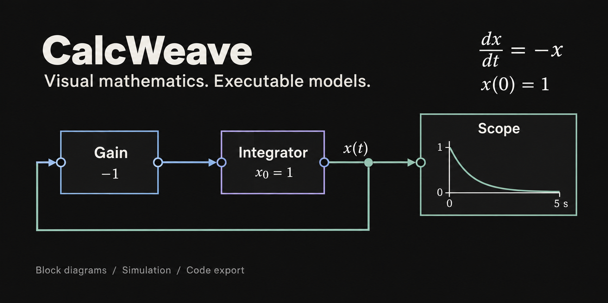

# CalcWeave

**블록선도로 수학적 관계를 표현하고, 브라우저에서 계산·시뮬레이션·코드로 실행하는 수학 도구입니다.**

[](https://jtech-co.github.io/CalcWeave/)

[](https://github.com/JTech-CO/CalcWeave/actions/workflows/pages.yml)
[](package.json)
[](docs/support-matrix.md)
[](apps/web/src/examples.ts)
[](tsconfig.json)

[웹에서 시작](https://jtech-co.github.io/CalcWeave/) · [기술 백서](docs/01-technical-whitepaper.md) · [디자인 백서](docs/02-design-whitepaper.md) · [지원 범위](docs/support-matrix.md) · [검증 결과](docs/validation.md)

## 목적

수식을 읽는 것에서 한 걸음 더 나아가, **입력·연산·상태·출력 사이의 관계를 직접 연결하고 결과를 관찰**할 수 있도록 만듭니다. 작은 산술 모델에서 시작해 시간에 따른 변화, 벡터와 행렬, 외부 데이터까지 같은 블록선도 안에서 다룹니다.

CalcWeave는 수학 교육과 자습, 신호·동역학 모델 탐색, 수치 알고리즘 실험에 활용할 수 있습니다. 모델과 파라미터를 함께 보관하고 실행 기록을 비교하여, 계산의 가정과 과정을 다른 사람에게 설명하기에도 적합합니다. 기본 계산은 브라우저의 JavaScript·TypeScript 엔진에서 수행하며 MATLAB 설치, 회원가입, 계산 서버가 필요하지 않습니다.

## 무엇을 할 수 있나요?

| 활용 | 구성과 관찰 방법 |
| --- | --- |
| 수학 개념 학습 | 상수·사칙연산·함수 블록을 연결하고 스칼라·벡터·행렬의 중간값을 확인합니다. |
| 신호와 동역학 탐색 | 피드백, 지연, 필터, 적분기를 구성하고 연속·이산·혼합 모델의 시간 응답을 Scope와 수치 표로 관찰합니다. |
| 수치 계산 실험 | LU·Cholesky·QR 등의 행렬 연산, RK4·RK45와 선택 범위의 implicit Euler를 사용하며 설정·오차·진단을 확인합니다. |
| 데이터 기반 계산 | CSV·JSON·XLSX 데이터를 불러와 시간·단위·자료형을 확인하고 신호로 재생합니다. |
| 결과 비교와 코드 활용 | 파라미터 실험과 실행 기록을 비교하고, 모델·데이터·결과를 파일로 보관하거나 지원되는 구성을 코드로 내보냅니다. |

현재 **337개 블록 정의, 75개 예제, 12개 예제 범주**를 제공합니다. 라이브러리 검색, 빠른 추가, 카테고리 접기와 자주 쓰는 블록으로 필요한 연산을 찾을 수 있습니다. 그래프는 계산의 흐름을 보여주고, 속성 패널과 진단은 자료형·설정·실행 조건을 확인하는 데 사용합니다.

## 첫 모델 실행

1. [CalcWeave](https://jtech-co.github.io/CalcWeave/)를 열고 **예제로 시작 → 첫 배율 계산**을 선택합니다.
2. Constant와 Gain을 선택해 값을 확인하거나 바꾼 뒤 **시뮬레이션 실행**을 누릅니다.
3. 출력 포트와 입력 포트를 연결해 연산을 추가합니다. 시간 모델에서는 실행 설정의 시간 범위와 솔버를 함께 확인합니다.
4. **모델 다운로드**로 도식을 보관합니다. 코드가 필요하면 **코드 다운로드**에서 해당 모델의 지원 여부를 확인합니다.

| 캔버스 조작 | 동작 |
| --- | --- |
| 휠 버튼 클릭·드래그 | 캔버스 이동 |
| 빈 공간에서 왼쪽 버튼 드래그 | 파란 사각형 범위로 블록 선택 |
| 캔버스에 초점이 있을 때 Space | 전체 도식 맞추기 |
| Shift를 누른 채 선택 | 여러 블록 선택 |
| Ctrl / Cmd + C, V | 선택한 블록과 내부 연결 복사·붙여넣기 |
| Ctrl / Cmd + K | 빠른 추가 |

### 예제 1 · 수식의 계산 흐름

**Constant(2) → Gain(3) → Display**를 연결하면 입력과 배율의 관계를 직접 볼 수 있습니다.

$$
y = 3u,\qquad u = 2\quad\Longrightarrow\quad y = 6
$$

입력 또는 배율을 바꾸고 다시 실행해 결과를 비교해 보세요. 덧셈이나 곱셈 블록을 추가하면 같은 방식으로 더 큰 식을 구성할 수 있습니다.

### 예제 2 · 미분방정식을 피드백으로 표현

위 소개 이미지의 도식은 **Integrator의 출력 → Gain(−1) → Integrator의 입력**을 연결하고 Scope에서 상태를 관찰하는 모델입니다. 적분기의 초기값을 1로 두면 다음 초기값 문제를 나타냅니다.

$$
\frac{dx}{dt} = -x,\qquad x(0) = 1,\qquad x(t) = e^{-t}
$$

**예제로 시작 → RK45 감쇠와 오차 제어**에서 같은 모델을 실행할 수 있습니다. 0~5초의 계산 결과를 해석해와 비교하고, 솔버의 시간 간격과 오차 허용치를 바꾸며 수치 근사가 어떻게 달라지는지 살펴보세요. 도식·설정·결과를 함께 남기면 실험을 설명하고 재실행하기가 쉽습니다.

## 영향을 받은 도구와 설계 원칙

[MATLAB Simulink](https://www.mathworks.com/products/simulink.html)의 블록선도 모델링 방식에서 출발했습니다. 수학적 관계를 시각적으로 연결하는 경험을 브라우저에서 바로 제공하고, 처음에는 작은 계산부터 시작해 필요한 연산과 설정을 점진적으로 찾아가도록 구성했습니다. CalcWeave는 독립적으로 실행되는 도구이며 MathWorks의 공식 제품이나 전체 호환 구현을 뜻하지 않습니다.

화면 구성에는 [SANE — Signal Above Needless Embellishment](https://github.com/JTech-CO/SANE/blob/main/SKILL-KR.md)의 정보 우선 설계 원칙을 반영했습니다. 읽기 쉬운 글자, 캔버스 중심의 배치, 절제된 카테고리 색상과 간결한 블록을 사용하고, 상세 정보는 필요할 때 속성 패널에서 확인하도록 했습니다.

## 어떻게 구축했나요?

화면은 **React·TypeScript·React Flow·Vite**, 계산은 별도의 TypeScript 패키지로 구성합니다. 블록선도와 실행 엔진 사이에 모델 검증과 중간 표현을 두어, 연결·자료형·설정에 맞지 않는 모델은 실행 전에 진단합니다.

```text
블록선도와 입력 데이터
  → 모델·포트·자료형·설정 검사
  → 컴파일된 중간 표현(IR)
  → Web Worker 계산 엔진과 솔버
  → 시간 응답·수치 표·진단·실행 기록
  → 지원 범위에 따른 모델 보관과 코드 내보내기
```

| 구성 | 역할 | 소스 |
| --- | --- | --- |
| 웹 작업 공간 | 캔버스, 블록 라이브러리, 속성·결과 패널 | [apps/web/src](apps/web/src) |
| 모델과 컴파일러 | 모델 구조, 블록 정의, 연결 검증, 실행 계획 | [model](packages/model/src) · [block-library](packages/block-library/src) · [compiler](packages/compiler/src) |
| 계산 엔진 | 신호 실행, 상태 갱신, 솔버, 확장 수학 연산 | [runtime](packages/runtime/src) · [advanced-math](packages/advanced-math/src) |
| 데이터와 분석 | 데이터 입력, 파라미터 실험, 결과 분석 | [data](packages/data/src) · [experiments](packages/experiments/src) · [analysis](packages/analysis/src) |
| 코드 생성 | 타깃별 지원 검사와 독립 실행 코드 생성 | [TypeScript](packages/codegen-ts/src) · [Python](packages/codegen-python/src) · [WASM](packages/codegen-wasm/src) |
| 검증 | 단위·브라우저 검사, 수치 비교와 검증 스크립트 | [tests](tests) · [fixtures](fixtures) · [scripts](scripts) |

모델과 실행 기록은 브라우저의 IndexedDB에 보관합니다. 정적 앱은 Service Worker로 캐시하고 배포 파일의 해시를 확인합니다. 모델·설정·실행 정보의 보관은 계산을 다시 확인하는 데 도움을 주며, 정확도 판단은 사용한 모델과 솔버, 지원 계약 및 비교 기준을 함께 살펴야 합니다.

## 로컬 개발과 검증

Node.js **22.12 이상**이 필요합니다. 잠금 파일의 의존성을 설치하고 개발 서버를 실행합니다.

```sh
npm ci
npm run dev
```

기본 검증과 정적 빌드는 다음과 같습니다.

```sh
npm run typecheck
npm test
npm run verify:docs
npm run build
npm run verify:release
```

브라우저 검사를 실행하려면 `npx playwright install chromium`으로 Chromium을 설치한 뒤 `npm run test:e2e`를 사용합니다. Python 코드의 실행 비교에는 별도의 Python 환경이 필요합니다. 추가 검증 명령, 환경별 조건과 결과는 [검증 안내](docs/validation.md), [운영 안내](docs/operations.md)를 참고하세요.

상단의 검증·배포 배지는 GitHub Actions의 결과를 나타냅니다. 공개 배포는 `main`에서 워크플로를 직접 실행하여 검증을 통과한 산출물을 게시하는 방식입니다.

## 지원 범위와 결과 해석

현재 앱 버전은 **0.17.3**, 계산 엔진 버전은 **0.17.0-m16**입니다. 블록 수는 등록된 정의의 수이며 모든 자료형·모드·옵션에서 동작한다는 의미는 아닙니다. 실제 모델의 지원 여부는 [공개 지원표](docs/support-matrix.md)와 [기계 판독 지원표](docs/support-matrix.json)에서 확인할 수 있습니다.

- TypeScript 내보내기는 승인된 실행 계약을 따릅니다. Python은 69개 블록 ID의 정적·이산 구성, WASM은 16개 블록 ID의 실수 스칼라 비순환 구성으로 제한됩니다. C/C++ 내보내기는 제공하지 않습니다.
- Simulink R2024b 참고 목록 385행을 [원자료 대응표](docs/block-coverage.md)로 추적합니다. 원본의 모든 옵션이나 MathWorks 실행 결과와의 수치적 동등성을 검증한 것은 아닙니다. MAT·SLX·MDL 처리는 선택 범위의 데이터·구조 분석이며 원본 실행 환경을 대체하지 않습니다.
- 현재 주 검증 환경은 Windows·Chromium입니다. Firefox·Safari 및 실제 초보 사용자 검증의 상태는 [검증 기록](docs/validation.md)에 명시합니다.

브라우저 저장 데이터는 기기와 브라우저에 종속됩니다. 보관할 모델은 다운로드하고, 데이터와 실행 기록까지 옮겨야 한다면 작업 공간 백업을 사용하세요. 저장·삭제·백업 방법은 앱의 **도움말**과 [운영 안내](docs/operations.md)에 있습니다.

저장소의 `docs/evidence`에는 검증 로그와 수치 결과가 포함됩니다. 이미지 캡처는 현재 화면 검증에 필요한 최종본만 보관하며, 과거 캡처를 다시 확인하는 방법은 [증거 보관 안내](docs/validation.md#화면-캡처-보관)에 있습니다.

## 문서와 문의

| 문서 | 내용 |
| --- | --- |
| [기술 백서](docs/01-technical-whitepaper.md) | 모델·컴파일러·실행 엔진과 데이터·코드 생성 구조 |
| [디자인 백서](docs/02-design-whitepaper.md) | 정보 구조, 화면 구성과 상호작용 원칙 |
| [지원 범위](docs/support-matrix.md) | 블록별 자료형·모드·옵션·내보내기와 검증 근거 |
| [검증 기록](docs/validation.md) | 자동 검사, 공개 동작 확인과 알려진 제한 |
| [운영 안내](docs/operations.md) | 빌드·배포·보관·복구 절차 |

운영자는 **JTech-Co**입니다. 오류 제보나 기능 제안은 [GitHub Issues](https://github.com/JTech-CO/CalcWeave/issues), 문의는 [jtech-bryan@proton.me](mailto:jtech-bryan@proton.me)로 보내주세요. 오류를 재현할 수 있는 작은 모델과 실행 설정을 함께 제공하면 확인에 도움이 됩니다.

현재 공개 주소는 [jtech-co.github.io/CalcWeave](https://jtech-co.github.io/CalcWeave/)이며, 목표 브랜드 도메인은 **CalcWeave.com**입니다. 사용·데이터 처리 안내는 [이용약관](docs/legal/terms.md), [개인정보 처리방침](docs/legal/privacy.md), [쿠키 정책](docs/legal/cookies.md)을 참고하세요.
