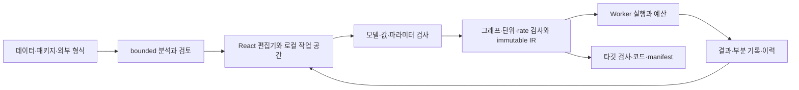

# CalcWeave 기술 백서

현행 앱 `0.23.0` / 엔진 `0.17.0-m16`의 설계와 실행 경계를 설명한다. 최종 실측·배포 상태는 [검증 문서](validation.md), 화면·상호작용은 [디자인 백서](02-design-whitepaper.md), 정책·복구·배포는 [운영 안내](operations.md)를 따른다. 현재 문서에 과거 단계의 시험 횟수나 납품 목록을 누적하지 않는다.

## 제품과 지원을 세는 방법

CalcWeave는 블럭과 연결선으로 값·계산·상태·관측을 표현하는 웹 도구다. 첫 결과를 얻기 위해 코드나 툴박스 체계를 먼저 배워야 하는 부담을 줄이고, 같은 모델을 정적 계산에서 시간 시뮬레이션·데이터·코드 export로 확장한다. 브라우저의 JS/TS 계산 엔진이 기본이며 외부 프로그램이나 계산 서버를 기본 실행 조건으로 요구하지 않는다.

337개 registry 정의와 75개 예제/12개 범주를 제공한다. [R2024b 원자료](../dataset/Simulink_Basic_Blocks_R2024b.md)의 21개 분류·385개 행·339개 영어 이름 문자열은 서로 다른 추적 지표다. 바로가기·공유 설정·조건부·레거시를 독립 계산 엔진으로 합산하지 않는다. 현재 선택 승인 367행·미지원 18행과 전체 옵션 동등 승인 0행을 구분한다.

[support-matrix.json](support-matrix.json)은 원본 ID·위치·identity SHA, 분류, 선택 파라미터 profile, 자료형, 모드, 타깃, 외부 조건과 증거를 담는다. 현행 [지원표](support-matrix.md)와 [상세 대응표](block-coverage.md)를 함께 읽는다. `selected-config-eligible`은 실제 모델을 compiler로 검증할 수 있는 후보라는 뜻이며 모든 파라미터 조합을 승인한 상태가 아니다. 원본 전수 옵션 inventory·MathWorks reference 실행·전체 수치/seed/bit parity는 미검증이다. [계획 JSON](simulink-coverage-roadmap.json)은 당시 배정 baseline으로 보존하며 현행 진척표로 재작성하지 않는다.

## 시스템 구조

| 층 | 실제 코드와 책임 |
| --- | --- |
| 모델·값 | [schema](../packages/model/src/schema.ts), [legacy signal](../packages/model/src/signal.ts), [typed](../packages/model/src/typed.ts), [structured](../packages/model/src/structured.ts): 사용자 입력·JSON·형상·자료형·단위·상한 검사 |
| 기능 선언 | [registry](../packages/block-library/src/index.ts): version1 포트·파라미터·shape·단위·모드·상태와 shared preset |
| 컴파일 | [compiler](../packages/compiler/src/index.ts): 참조·필수 포트·타입·단위·sample time·현재값 의존성·상태·기록 예산을 검증하고 실행 순서를 결정 |
| 실행 | [runtime](../packages/runtime/src/index.ts), [이산 machine](../packages/runtime/src/discrete-machine.ts), [연속 machine](../packages/runtime/src/continuous-machine.ts): immutable IR와 별도의 run-owned memory·publication·overlay |
| Worker | [worker](../apps/web/src/engine.worker.ts), [client](../apps/web/src/worker-client.ts): request ID·모델 snapshot·실행 상태·취소·응답 최신성을 관리 |
| 외부 파일 | [data](../packages/data/src/index.ts), [model-package](../packages/model-package/src/index.ts), [interop](../packages/interop/src/native.ts): 선언형 데이터 분석과 명시 검토 경계 |
| 공개 지원 | [support-matrix API](../packages/support-matrix/src/index.ts), [release](../packages/release/src/index.ts): 현재 지원·한도·타깃 검사와 실제 증거를 사용자에게 제공 |

이름·위치·설명 같은 편집 정보와 계산 의미를 분리한다. semantic hash는 실행 의미를 정규화하며 파일/artifact hash·dataset hash·원본 서명 hash와 같은 지표로 취급하지 않는다. 한 실행의 모델·데이터·하위 정의·설정은 snapshot이다. 실행 중 편집은 다음 실행에 적용하며, 승인된 대시보드 live 입력만 별도 due 경계에서 기록·재생한다.

## 모델·자료형·단위

모델 schema1은 블럭·연결·배치·실행 설정·포함 Dataset·하위 정의·주석·Dashboard를 선언형 JSON으로 저장한다. 접근자·비정상 prototype·unsafe key·희소 배열·숨김 속성·과도한 깊이와 크기를 실제 값을 읽기 전에 검사한다. 일반 숫자 JSON의 −0은 기존 모델 복사에서 +0으로 정규화될 수 있다. IEEE signed zero가 필요한 저장 신호는 typed wire의 `'-0'`를 사용한다.

| 값 계열 | 계약 |
| --- | --- |
| legacy | 유한 float64 또는 boolean의 scalar·동종 1D·직사각형 2D. 한 신호 1024원소 이하이며 숫자/boolean의 조용한 혼합·cast가 없다. 고급 실수 행렬 알고리즘은 별도 축32 상한을 적용한다. |
| typed | `{kind:'typed',dtype,shape,data,fixed?,enum?}`. rank≤8·축≤1024·전체원소≤1024. dtype은 float64/float32/boolean, int8..64/uint8..64, complex128/fixed/string/enum이다. |
| 정확한 코드 | 모든 integer와 fixed storage code는 canonical decimal string이다. 64bit 값을 먼저 Number로 바꾸지 않는다. fixed는 wordLength≤64·fractionLength −64..64·bias0의 binary-point scaling이다. |
| IEEE 값 | finite number 또는 `'-0'/'NaN'/'Infinity'/'-Infinity'`; complex는 같은 encoding의 `{re,im}`다. specials의 전파/거부는 해당 typed 연산·cast 옵션으로 결정한다. legacy로 내보낼 때 표현 불가능한 정수·fixed, specials·허수 손실을 명시 거부한다. |
| string·enum | 문자열 원소≤256 UTF-16 code unit, enum name≤64자·label≤64자·label64개 이하. string의 길이·검색·substring 연산은 명시한 Unicode code point 규칙을 따른다. |
| bus | 이름 있는 최대16필드의 이질·중첩 값. depth≤8·논리원소≤1024·가중저장≤100000. 필드별 dtype·shape·unit을 보존한다. |
| messages | 최대64개 `{producer,sequence,time,priority,payload}`. payload는 signal/bus이며 messages 중첩은 허용하지 않는다. |

typed rounding은 floor/ceil/zero/nearest(동률 +∞)/away(동률 0에서 멀어짐)/even, overflow는 wrap/saturate/error로 구분한다. `real-world`와 `stored-integer` 변환을 혼동하지 않는다. Scaling Strip은 real-world float64가 아니라 stored code와 이를 담는 최소 builtin 정수 폭을 뜻한다. Stored Integer 증감은 real 값 ±1이 아닌 code ±1과 wrap이다. complex conjugate·Hermitian·dot의 수학 의미, tensor reshape/permute/squeeze의 row-major 순서는 실제 typed helper와 compiler shape 검사를 따른다.

[unit 검사](../packages/model/src/units.ts)는 지원된 물리 차원과 곱·나눗셈·제곱·무차원 조건을 검증한다. 자동 단위 추정만으로 값의 scale을 바꾸지 않으며 `unit.convert`가 scale/offset을 명시한다. 온도 affine 변환도 일반 gain과 구분한다. 배열 인덱스는 각 블럭의 `indexBase`/out-of-range 계약으로 결정하고 임의 MATLAB 인덱스 규칙을 전역 적용하지 않는다.

## 그래프와 정적 계산

compiler는 각 노드의 현재 출력에 필요한 direct-feedthrough 입력을 기준으로 DAG를 만든다. Unit Delay 같은 저장 경계를 통과한 순환은 가능하지만 현재값만의 순환을 조용히 한 번 평가하지 않는다. 일반 순환은 위치 있는 진단이며, 명시한 `solver.algebraic-constraint`의 선택 smooth SCC만 실제 residual solver로 푼다.

정적 실행은 상태 없는 승인 그래프를 한 번 평가한다. scalar broadcast·원소별 계산·축 집계·행렬 계산은 해당 registry의 shape 규칙을 따른다. 나눗셈0·수식 정의역·비유한 중간 결과도 출력에 연결되지 않은 Terminator 경로에서 검사한다. 행렬 inverse/solve/LU/Cholesky/QR의 rank·pivot·conditioning 검사와 lookup의 비균일 breakpoint/interpolation/extrapolation을 명시하며 일반 symbolic math나 모든 행렬 factorization을 약속하지 않는다.

사용자 수식은 [bounded AST](../packages/expression/src/index.ts)의 숫자·x/pi/e·허용 함수와 연산자만 해석한다. 수식512자·AST128노드·depth32 이하이며 eval/Function·속성 접근·사용자 JS callback은 없다. 문자열 Compose/Scan의 format도 bounded grammar와 자료형을 검증하며 사용자 regex/code를 실행하지 않는다.

## 이산시간·상태·rate

노드 sample time은 base tick의 정수 `period`/`offset`이다. `period` 1..10000, `offset` 0..period−1이고 `(tick-offset)%period===0`인 due에서 평가한다. 초 단위 Ts는 physical base step과 정수 period의 일치 조건으로 compile한다. 현재값 의존성 경로의 서로 다른 rate는 명시 Rate Transition을 요구한다. 주기를 바꿔도 시간축을 정수 tick으로 결정하며 unsigned overflow나 숨은 sampling을 허용하지 않는다.

각 due는 이전 state/held 값을 읽고 출력·publication·commit 후보를 계산한다. 성공한 tick만 owned memory와 결과에 반영하며 실패한 tick의 state·queue·parameter overlay·history를 되돌린다. 최종 표본 이후 추가 전이는 없다. 미도래 노드는 held 출력, 초기화·reset·enable은 각 블럭의 명시 조건을 사용한다. PRNG는 고정한 CalcWeave seed 상태로 재현하며 MathWorks 난수 sequence 동등성은 주장하지 않는다.

DF1/DF1T/DF2/DF2T의 상태 좌표·초기조건과 `z⁻¹`/descending-z 계수 순서는 다른 설정이다. discrete integrator의 Forward/Backward/Trapezoid, PID/2DOF의 목표 가중치·anti-windup·enable/reset, MIMO 행렬과 정수 due delay는 각각 compile/runtime 계약을 따른다. publication delay·FOH 과거샘플 외삽·Memory major boundary·Unit Delay tick 저장은 같은 alias가 아니다. PWM은 승인한 cycle 경계 latch 의미를 사용한다.

## 연속·혼합 실행과 해석

출력 표본 격자와 solver 내부 간격을 분리한다. RK4는 고정 간격, RK45는 실제 embedded error·수락/거절과 간격 제한을 사용한다. implicit Euler는 step-doubling error estimate와 dense Newton finite-difference Jacobian·line search로 implicit residual을 푼다. RK fallback을 implicit solver의 성공으로 표시하지 않는다.

| 항목 | 실제 경계 |
| --- | --- |
| 공통 solver | 내부 수락 step≤100000·거절≤10000·미분 평가≤1000000·event≤10000. tolerance·최소/최대 간격과 연산/wall 예산이 함께 적용된다. |
| implicit Euler | dense unknown/state≤64, Newton≤32반복·line-search≤12. `newtonTolerance` 1e−14..1e−3(default1e−9), `newtonMaxIterations` 1..32(default24), `jacobianStep` 1e−8..1e−2(default1e−6). |
| algebraic constraint | 명시 unknown의 zero/fixed-point residual을 실제 joint SCC에서 푼다. 실패·singular/conditioning·capture causality를 진단하고 실패 trial은 commit하지 않는다. |
| descriptor | 선택 semi-explicit index1 partition을 reduced ODE로 풀고 algebraic state를 재구성한다. `initialPolicy` error/project와 initial consistency를 검사한다. 일반 descriptor/DAE·ode15s 동등성은 미승인이다. |
| discontinuity | 등록된 Step·Hit Crossing·Relay·reset·limit 사건 또는 명시 sample/hold 경계를 사용한다. 미등록 시간변화 predicate를 ODE 입력에 연결해 stage마다 임의 관측하지 않는다. |
| delay | 승인한 accepted-step history와 interpolation을 사용한다. variable time delay는 u(t−τ); variable transport는 q′=1/τ history의 q−1 inverse이므로 단순 time-delay alias가 아니다. history·delay 범위 상한을 적용한다. |
| 비선형 state | integrator 위치/속도 제한·backlash·rate limiter는 승인된 경계와 accepted memory를 사용한다. tie/reset·limit 해제·실패 trial rollback을 검증한다. dynamic rate는 explicit sampled state이다. |
| 해석 | `analysis.linearization`은 선택 smooth plant의 operating point에서 실제 미분/출력 FD Jacobian A/B/C/D를 계산한다. 상태1..16·입출력1..8, real interior·smooth 조건이며 timed/rising trigger를 구분한다. 자동 튜닝·MATLAB 선형화 전체 옵션은 미승인이다. |

solver 통계는 실제 수락·거절·미분 평가·사건·간격을 설명한다. 실패 부분 결과는 마지막 승인된 표본/상태까지만 제공한다. 부분 결과가 있다고 전체 실행 성공으로 표시하지 않는다. pause 동안 wall active 시간을 제외하되 수행한 실패 trial의 연산은 환불하지 않는다.

## 도식 수식 설명과 학습

[수식 설명기](../packages/analysis/src/diagram-equations.ts)는 모델 schema와 compiler로 검증한 IR의 현재 파라미터·연결·실행 시간·단위를 읽는다. 모델을 실행하거나 수정하지 않고, 사용자 라벨을 수식 문법에 삽입하지 않으며 생성한 기호와 블록 ID의 대응을 별도 보관한다. 화면에서는 텍스트와 블록 선택 버튼으로 렌더링한다.

상수·입력·Gain·Sum·Product·관측·Unit Delay·연속 Integrator·선택 단항 함수·단위 변환의 기존 float64 scalar 관계를 설명한다. 도식 형태가 확인된 범위에서는 출력까지 전개한 식, 피드백 점화식, 초기조건과 지수 감쇠 해를 추가한다. Unit Delay는 이전 상태의 출력과 다음 틱 갱신을 구분하고, 연속 초기값과 해석해는 실제 시작 시간을 기준으로 한다. 배열·typed·boolean·bus·message·하위 도식·reset·비기본 주기/offset·연속/이산 held 경계는 지원하지 않는 이유를 표시한다. 식은 최대256개, 전개는 최대128항·깊이24로 제한한다.

[세 학습 가이드](../apps/web/src/learning.ts)는 기존 예제의 실제 연결·모드·신호 형식을 확인하고 현재 계수로 독립 예상값을 계산한다. 정상 완료한 현재 실행의 전체 시간 격자·모든 출력 표본을 비교한다. 정적·이산 비교는 `1e-9 × max(1, |예상값|)`, 연속 비교는 `1e-5 + |예상값| × 1e-4`의 명시 허용오차를 사용한다. 차이가 생기면 재계산·간격·solver 설정 검토를 안내하고, 실패·취소·부분 결과와 이전 모델 결과로 일치를 승인하지 않는다. 이 비교는 사용자 글의 정답 판정이나 전체 solver 정확도 보증을 뜻하지 않는다.

예상240자·설명500자는 학습 컴포넌트 메모리 안에 보관한다. 결과 탭 전환과 계수 편집에서 유지하고 학습 닫기·다른 예제 열기에서 지운다. 모델 schema·registry·엔진 실행 버전은 바뀌지 않는다. 관련 회귀는 [수식 검사](../tests/m17-equations.test.ts), [학습 계산 검사](../tests/m17-learning.test.ts), [실제 화면 흐름](../tests/e2e/m17-learning.spec.ts)에 있다.

## 계층·함수·메시지·공유 상태

투명 Subsystem은 port binding·definition ID/version·실제 child state를 compiler에서 전개한다. controlled scope는 별도의 owned JSON checkpoint로 매 호출 출력→commit을 수행한다. 같은 physical time의 여러 function call/loop iteration도 상태를 진전시키며, 마지막 호출도 commit한다. variant의 inactive body는 실행하지 않는다.

enabled는 enable>0, trigger는 rising/falling/either, action은 activation, reset은 rising/level의 서로 다른 조건이다. disabled output hold/reset과 re-enable state hold/reset을 분리한다. For count0..64·While max64(미종료는 실패)·ForEach partition별 독립 bank≤64·scope depth≤8·중첩 전체 호출4096/outer tick을 제한한다. 현재 선택 controlled wrapper의 부모 data binding은 모두 feedthrough 의존성이며 opaque wrapper 저장경계를 이용한 부모 closed-loop는 미지원이다. child 내부의 genuine delay feedback은 지원한다.

initialize/reinitialize/reset/terminate function은 첫 due·rising edge·정상 terminal due의 선택 실행이다. 일반 호스트 취소/종료 callback과 동일시하지 않는다. `functions.typed`는 승인한 legacy finite scalar AST이다. 태그·data store·state/parameter reader/writer는 동일 lexical graph와 whitelist target만 허용한다. 명시 순서의 staged write가 뒤 read에 보이며 실패 frame에서 전체 effects를 rollback한다. frozen IR 자체를 수정하지 않는다.

메시지 queue는 낮은 priority 먼저·동률 stable arrival, read/dequeue 후 enqueue, producer별 high-water sequence와 최대128 producer의 중복 억제를 사용한다. 최대 batch64와 payload contract를 검사한다. 실제 queue capacity·overflow·maxDequeue는 선언 파라미터다. 별도 entity adapter FIFO는 우선순위 queue와 다르다. Merge는 실제 publication writer를 추적하고 동시 conflicting writer를 진단한다.

## 데이터·관측·실험

Dataset은 ID/version·열 kind/unit·시간열·content hash를 갖는다. 이름/provenance와 열·시간·행의 계산 hash를 분리한다. CSV/JSON/XLSX 읽기는 검토 가능한 타입·열 mapping·결측/중복/정렬/단위 정책을 사용하며 원본을 조용히 수정하지 않는다. playback의 linear/previous 및 범위 밖 hold/error를 명시한다. XLSX는 값 전용이며 formula·macro·외부 link·DTD/entity·ZIP traversal/CRC 오류를 거부한다.

record/XY/floating scope/data outputs는 승인된 due 관측과 bounded trace를 저장한다. Scope의 시간 범위 조정은 결과 viewport와 모델 stopTime 반영을 구분한다. Probe는 실제 width/rank/shape/complex/sample period/offset을, catalog source는 실제 현행 registry/target 정보를 출력한다. 문자열은 UTF-16 storage bound와 code-point 연산을 구분하며 ASCII→uint8/NUL/length와 parse enum·strict parse number·fixed/IEEE tag formatting을 실제 contract로 처리한다.

Dashboard의 기존 모델 파라미터 binding과 신규 live control source를 구분한다. live는 discrete에서만 최대 대기256·한 drain32이며 다음 노드 due의 actual time·order·value receipt를 기록한다. order≤1000000이고 미래 schedule과의 충돌을 피한다. raw −0 control publication/receipt는 +0이며 계산으로 생긴 −0은 별도 IEEE 의미다. Worker가 receipt로 만든 replay model이 동일 samples/state를 재현해야 한다. stop sink는 일반 오류가 아니라 `completed`와 `stopReason`을 반환하며 마지막 승인 경계까지만 기록한다.

실험 sweep은 snapshot마다 최대16run·전체 공유 연산/기록/wall 예산을 쓴다. scalar 수치 비교·history 최대5개·복구와 설명 provenance를 제공한다. 결과가 만들어진 모델·데이터·설정과 현재 편집본의 차이를 표시한다.

### Scope 관측과 실행 비교

[관측 투영기](../packages/analysis/src/scope-observation.ts)는 최대3개 실행과 실행당10,001개 원시 샘플을 검증하고, 선택한 수치 성분을 그대로 읽는다. legacy 실수 scalar·vector·2D 및 typed 실수 scalar·vector를 지원하고 행우선 성분을 사용한다. Typed 2D 이상은 원본 표에서 확인한다. boolean·복소수·문자열·버스·메시지를 자동 수치 변환하지 않는다. 출력의 단위·형상·자료형이 다르면 중첩을 거부한다.

Typed 곡선은 float64 근사이고 커서에는 원본 값 또는 고정소수점 저장 코드를 별도로 보존한다. NaN·무한대 구간을 선으로 연결하지 않으며, 표본을 줄여 순간 최대값을 숨기지 않는다. 같은 축은 모든 선택 곡선에서 정하고 큰 float64 값을 정규화하여 유효한 SVG 좌표를 만든다.

보기 구간은 실행 설정과 분리하고 모델·결과·실행 기록을 수정하지 않는다. 커서는 실행마다 가장 가까운 원시 샘플을 선택하며 동률이면 앞선 시각을 사용한다. 요청 시각과 실제 기록 시각은 별도로 표시하고 곡선 사이를 보간한 값을 계산 결과로 제시하지 않는다. 부분 실행 상태도 투영 결과에 보존한다. 기존 동일 격자 scalar RMSE 비교와 이 그래프 중첩은 각각의 검사 경계를 유지한다.

### 다변수 탐색과 측정 자료 피팅

[실험 코어](../packages/experiments/src/multivariable.ts)는 루트 모델의 scalar Constant·Input 값 또는 Gain 배율을 최대3개 지정한다. 격자는 축 순서와 각 축의 입력 값 순서대로 모든 조합을 열거하고, 전체 후보를 먼저 컴파일한다. 최대64회 실행, 공유30초·1,000,000기록 원소·50,000,000연산을 적용한다. 기존 단일 스윕과 같은 실행 결과 검증을 공유하며, 임의 executor의 접근자·순환 객체·위조된 자원 보고를 거부한다.

피팅은 legacy float64 scalar 출력과 같은 단위의 최대1,000개 측정값을 사용한다. 측정 시각을 기존 관측 격자에 부동소수점 허용 오차 내에서 대응하고 보간하지 않는다. 시작 계수·하한·상한은 유한하며 절댓값10¹² 이하여야 한다. 정규화한 계수에 대해 유한 차분 Jacobian, 감쇠 Gauss–Newton 방정식, 제한한 스텝과 경계 투영을 사용하는 자체 구현이다. 최대96회 실제 평가와 위 공유 자원 한도를 적용하고, 실패·취소 실행을 최적 후보로 순위화하지 않는다. 국소 감도에서 독립적인 계수 변화가 관측되지 않으면 진단한다. 이 진단은 전역 식별 가능성 증명이 아니다.

잔차는 예측−측정, SSE는 잔차 제곱 합, RMSE는 평균 제곱 오차의 제곱근이다. 정확한 원시 예측값·측정값·잔차를 보고서에 보관한다. 이 문제 정의의 참고는 [SciPy의 경계를 갖는 최소제곱 문서](https://docs.scipy.org/doc/scipy/reference/generated/scipy.optimize.least_squares.html)이며, CalcWeave가 SciPy/TRF/MINPACK 구현이나 결과 동등성을 제공한다는 의미는 아니다.

모델·측정 자료·결과를 후보마다 복사하며 탐색만으로 원본을 수정하지 않는다. 보고서는 실행 당시 설정과 측정값, 후보 모델·실제 결과·manifest를 JSON에 포함한다. 명시적 적용은 실험 당시와 현재 계산 의미가 같은 경우에만 계수 필드를 변경하고 제목·레이아웃을 보존한다. 편집기 undo에 연결한다. 격자는 기존 최근5개 실행 기록 정책을 따르고, 피팅은 완료한 최적 후보 실행만 보관한다. 전체 보고서는 메모리에서 유지하므로 사용자가 파일로 내려받는다.

### 연속 SISO 제어계 분석

[제어계 분석 코어](../packages/analysis/src/control-system.ts)는 실수 연속 상태공간 A(n×n), B(n×1), C(1×n), D(1×1), 상태1~4개를 지원한다. 행렬 원소의 절댓값은10⁶ 이하이며 접근자·희소 배열·자료형 강제 변환을 허용하지 않는다. [출처 어댑터](../apps/web/src/control-analysis-sources.ts)는 현재 루트 State-Space 설정과 실제 선형화 완료가 확인된 직접 연결 출력만 최대64개 제공한다. 마지막 요청 시각·완료 행렬·마지막 원시 기록 행렬·실행 모델 SHA를 대조한다. 요청 전 영 행렬 placeholder와 실제로 완료한 영 행렬을 구분한다. 이전 실행과 부분 실행의 출처도 보존한다.

주파수 응답은 G(jω)=C(jωI−A)⁻¹B+D의 복소 선형계를 직접 푼다. 10⁻⁶~10⁶ rad/s에서 최대801개 로그 표본을 사용하며 특이점과 표현할 수 없는 응답은 JSON의 null과 상태로 보존한다. 상태 특성식과 미약분 전달함수 계수를 저차 행렬식으로 계산하고 극점·영점을 구한다. 1·2차 근은 해석식, 3·4차는 제한된 반복과 잔차 검증을 사용한다. 확정하지 못한 반복·근접 근과 계수 계산의 표현 범위 초과는 분석을 거부한다. 허수축 근방은 수치 확인이 필요한 상태로 표시하며, 자동 pole-zero 상쇄나 MIMO·이산·descriptor 변환을 수행하지 않는다.

이득·위상 여유는 사용자가 선택 행렬을 개루프로 지정했을 때 단위 음의 피드백의 정의를 적용한다. 유한 주파수 표본의 부호 변화와 구간 내 재평가로 교차를 좁힌다. 접선·좁은 교차·선택 범위 밖의 교차 전수 검출은 보장하지 않는다. 교차 없음·불완전 분석을 무한 여유 또는 전체 폐루프 안정성으로 해석하지 않는다. 근궤적은 det(sI−A)+K·분자의 근을 최대81개 이득에서 계산한 원시 표본이며, 1+KD=0인 잘못 정의된 피드백과 확정하지 못한 근은 별도 상태로 남긴다. 전체 계산은2,000,000 work 상한을 검사한다.

모델·실행·관측 시각을 변경하지 않으며, 보고서에는 복사한 행렬과 출처·설정을 함께 보존한다. [python-control의 주파수 응답](https://python-control.readthedocs.io/en/latest/generated/control.frequency_response.html), [여유](https://python-control.readthedocs.io/en/latest/generated/control.margin.html), [근궤적](https://python-control.readthedocs.io/en/latest/generated/control.root_locus_map.html), [SciPy의 상태공간 변환](https://docs.scipy.org/doc/scipy/reference/generated/scipy.signal.ss2tf.html)은 수학적 정의를 참고한다. 해당 라이브러리를 실행하거나 전수 수치 동등성을 제공하는 구현을 뜻하지 않는다.

### 이산 SISO 제어계 분석

[이산 코어](../packages/analysis/src/discrete-control-system.ts)는 연속 분석과 [공통 내부 수치 루틴](../packages/analysis/src/control-analysis-internal.ts)을 공유한다. 순수 이산 모델의 루트 `discrete.state-space`, 리셋 `none`, 실수 SISO 상태1~4개를 [현재 설정 출처](../apps/web/src/discrete-control-analysis-sources.ts)로 읽는다. 컴파일 후 정규화된 period×execution.step을 초 단위 Ts로 사용하고 offset은 due 격자의 시간원점으로 보존한다. 하이브리드 모델의 solver.discreteStep을 관측 간격과 혼동하지 않도록 이 단계에서는 연속·하이브리드 출처를 제외한다. 5~16개 실행 상태를 임의로 축소하지 않는다.

y[k]=Cx[k]+Du[k], x[k+1]=Ax[k]+Bu[k]의 영 초기상태 LTI 응답 H(z)=C(zI−A)⁻¹B+D를 z=exp(jωTs)에서 직접 계산한다. Ts는10⁻⁹~10⁹초, ω는10⁻⁶~min(10⁶,π/Ts) rad/s의 양의 로그 범위다. 유효한 증가 구간이 없으면 거부하고 DC를 로그 축에 끼워 넣거나 Nyquist 초과를 alias 보정하지 않는다. 단위원 안/밖 상태 극점으로 안정/불안정을 구분하며 |z|≈1은 경계로 표시한다. 복소 z 평면과 계수는 무차원이며 전달 다항식은 z의 내림차순이다.

여유는 선택 블록을 개루프 L(z)로 명시한 단위 음의 피드백에서만 표시한다. 근궤적은 det(zI−A)+K·분자의 지정 이득 표본이고 직접 전달항의1+KD=0은 별도 잘못 정의된 상태다. 행렬 원소·주파수 표본·K 표본·work·수치 불확실성의 한도와 특이점의 null 구간은 연속 코어와 같다. 주변 Rate Transition의 버퍼 지연·다중 rate 연결·비영 초기조건·실행 중 리셋을 자동 포함하지 않으며, 교차 없음이나 표본의 안정성으로 전체 폐루프 안정성을 보증하지 않는다.

수학적 정의는 [python-control의 단위원 주파수 응답](https://python-control.readthedocs.io/en/latest/generated/control.frequency_response.html)과 [SciPy 이산 주파수 응답](https://docs.scipy.org/doc/scipy/reference/generated/scipy.signal.dfreqresp.html)을 참고한다. SciPy의 rad/sample과 이 UI의 물리 rad/s는 ωTs로 구별하며 새 npm 의존성·외부 계산 서비스를 추가하지 않는다.

## 기록의 스펙트럼

[스펙트럼 코어](../packages/analysis/src/spectrum.ts)는 완료한 시간 기록의 선택 성분·연속 구간을 분석한다. 8~8192개의2의 거듭제곱 개수만 허용하며, 시각은 절댓값10⁹ 이하·균일 증가·간격10⁻⁹초 이상, 값은 절댓값10¹² 이하의 유한 실수다. float64의 시간 표현 정밀도가 간격에 비해 부족하면 거부한다. 최소 간격의8eps 이내 계산 반올림만 정규화한다. 원시 시각을 보간하거나 자동으로 표본 수를 조정·0 채우기 하지 않는다.

평균을 제거한 뒤 선택 창을 곱하고 비정규화 forward DFT를 radix-2 FFT로 계산한다. 직사각형 또는 주기형 Hann wᵢ=0.5−0.5cos(2πi/N)을 사용한다. 단측 진폭은 q|Xₖ|/Σwᵢ, PSD는 q|Xₖ|²/(fsΣwᵢ²)이며 DC·Nyquist에서q=1, 나머지는q=2다. 빈 간격은fs/N이고 적분 전력은ΣPSD·fs/N이다. mean·RMS는 창 적용 전 원시 선택 값이며, Hann이나 평균 제거 후 PSD 적분 전력을 원시 RMS²와 같다고 표시하지 않는다. 위상은 첫 선택 표본 기준으로 작은 계수는null로 보존하고, 최대 성분은 DC를 제외한 실제 빈에서 선택한다. 빈 사이의 피크 추정·aliasing 보정은 없다. 이 정의는 [NumPy DFT](https://numpy.org/doc/stable/reference/routines.fft.html)와 [SciPy periodogram](https://docs.scipy.org/doc/scipy/reference/generated/scipy.signal.periodogram.html)을 참고하며 해당 라이브러리의 모든 기능을 구현하거나 수치 동등성을 인증한 것은 아니다.

[출처 어댑터](../apps/web/src/spectrum-analysis-sources.ts)는 실행 모델의 의미 지문, completed 상태·표본 수·전체 관측 격자·자료형/형상을 대조한다. 실수 legacy 스칼라·벡터·행렬과 Typed float32/float64 스칼라·벡터만 지원한다. 출력은최대16개·투영 원소합1,000,000개, 코어 work는2,000,000 이하이며 접근자·희소 배열·숨김 필드를 실행하지 않는다. 선택한 시각·값을 복사해 SHA-256을 기록하고 출처·창·평균 제거·모든 원시 복소 빈을 JSON에 보존한다. 정수·fixed·복소수·boolean·structured 신호, 부분 실행, 비유한 값과 불균일 격자는 자동 변환하지 않는다. 분석 기능 추가를 실행 블록·schema·코드 타깃 지원 확대와 혼동하지 않는다.

## 신뢰된 어댑터

외부 사용자 코드 실행 대신 [immutable adapter catalog](../packages/model/src/m14-adapters.ts)의 자체 작성 고정 프로필만 실행한다.

| 정의 | ABI와 제한 |
| --- | --- |
| `adapter.wasm-affine` | 단위1·유한 legacy f64 scalar의 `in*gain+bias`. 고정48byte/ABI1 WASM, static/discrete/continuous와 pure child 허용. |
| `adapter.wasm-accumulator` | initial/gain/resetMode; root discrete only. 실제 initialize/read/accumulate/reset/terminate 순수 ABI 호출과 JSON-owned state. reset은 현재 출력 전에 적용하고 reset hit의 현재 입력도 다음 상태에 capture한다. |
| `adapter.entity-transport` | root discrete messages FIFO, capacity/maxRelease≤64. acceptedTime+delay deadline·다음 due부터 release, head blocking·read-before-enqueue·중복 억제·overflow error/drop 정책. SimEvents delay integral 대체가 아니다. |

고정 WASM byte SHA·export signature·제한 instruction 검사 후 instantiate한다. imports/memory/table/global/start/loop/call·URL·user module loader·host callback은 없다. stateful 초기화 때 고정 terminate 비용을 선예약하고 completed/cancelled/failed의 actual termination을 한 번 기록한다. finalize는 이미 승인한 stateMemory·부분 결과를 변경하지 않는다. trap·host unavailable·ABI 오류에 fallback 결과를 만들지 않는다. native C/MATLAB/System/S-function 환경과 외부 권리는 unavailable/NOASSERTION으로 분리한다.

## 코드 타깃과 재현성

| 타깃 | 선택 실행 범위 | 실제 API·검증 |
| --- | --- | --- |
| TypeScript | 현행 승인된 registry와 static/discrete/continuous 계약. 데이터·scope·typed·solver·어댑터의 각 제한도 동일 적용. | [generator](../packages/codegen-ts/src/index.ts): import-free ES2022 고정 runtime과 데이터·manifest. [실제 실행 회귀](evidence/m14-verification.json) 및 [M15 전체 통합](evidence/m15-verification.json). |
| Python | `python-m15-v1` 69개 ID. 기존51 legacy와 string15/source3, 신규 typed scalar·ASCII uint8 vector≤256. | [capabilities](../packages/codegen-python/src/capabilities.ts), [generator](../packages/codegen-python/src/index.ts), [actual Python3.14 proof](evidence/m15-python-verification.json). Python3.10+ 표준 라이브러리; user eval/exec/module/regex 없음. |
| WASM | `wasm-m15-v1` 16개 ID, finite legacy f64 scalar root DAG·static/base-tick discrete. | [capabilities](../packages/codegen-wasm/src/capabilities.ts), [generator](../packages/codegen-wasm/src/index.ts), [actual module/runner proof](evidence/m15-wasm-verification.json). |
| C/C++ | 승인 실행 타깃 없음. | unavailable 진단과 제품/툴체인/ABI·권리·actual build/run gate를 표시한다. |

Python의 과거 `PYTHON_M7_TARGET`51개와 canonical registry의 frozen export metadata를 보존하며, 현행 타깃은 별도 versioned capability에서 판단한다. 신규 typed complex/bus/messages·일반 n-D·continuous/hierarchy/native adapters는 Python 미지원이다. 지원 거부는 원래 nodeId/option 위치를 포함한다. formatter의 JS fixed tie와 strict parser·float32/special/code/enum 의미를 실제 실행 oracle로 검증한다.

WASM ABI는 `evaluate(valueIndex:i32,time:f64)->f64`다. type/function/export/code section과 제한 opcode만 emit하며 상태·typed/boolean/array·continuous·Dataset·live/hierarchy는 미지원이다. 최대64node·16output·64KiB binary·10000interval·1000000기록·50000000실제 instruction work·30000ms를 제한한다. 같은 DAG를 N개의 intermediate valueIndex 호출로 N번 계산하는 비용을 숨기지 않는다. 고정 runner는 supplied byte/manifest/model identity를 검사하고 실패한 표본을 기록하지 않는다.

manifest는 model/semantic/data hash, target/engine version, modes·units·sample grid·필요 feature·제약을 설명한다. controlled child·analysis program의 feature/data도 재귀적으로 수집한다. 생성 전에 원본을 다시 compile하고 IR snapshot 일치를 확인한다. 검증은 모든 times/samples·finalState/stateMemory·실패 partial·정확 typed tags·signed zero·artifact/manifest, JSON 왕복·노드 삽입 역순과 실제 생성 프로그램 실행을 비교한다. native와 생성 코드가 같다는 것은 원본 Simulink와 동등하다는 뜻이 아니다.

## 파일·서명·migration 경계

일상적인 도식 전달은 header의 **모델 다운로드·가져오기**를 사용한다. 선언형 `.cw.json`은 블록·연결·실행 설정과 포함 데이터·하위 도식·대시보드·노트를 보관하므로 일반 전달에 서명 패키지가 필수는 아니다. 작업 공간 백업은 현재 모델에 선택한 실행 기록을 함께 보관하는 별도 형식이며 **작업 공간 → 백업·복구**에서 제공한다. 저장 문제 해결·백업 검증 정보·저장 데이터 삭제는 이 화면의 접힌 영역에서 확인한다. 영역을 접어도 schema/hash 검증·원본 보존·revision 충돌 검사·검토와 명시 확인을 거치는 삭제 절차는 유지한다.

서명된 모델 패키지는 별도 경로로 확인한 공개 키 지문과 파일의 서명을 대조할 필요가 있을 때 사용하는 고급 기능이다. 일회용 키와 지문은 의도된 출처 확인 절차였으나 기본 화면의 독립 공유 버튼과 상세 관리 정보는 첫 계산에 필요한 정보량을 넘겼다. 현행 경로는 **작업 공간 → 고급 파일 → 서명된 모델 패키지**이며 기본 메뉴의 고급 파일은 닫혀 있다. SHA checksum은 손상 검출이며 출처 인증·암호화가 아니다. P-256 패키지 서명은 원본 payload와 확인한 키의 관계를 검증하며 작성자의 실명이나 계정을 인증하지 않는다. 파일에 있는 key로 파일 자체의 출처를 자동 신뢰하지 않는다. signing private key는 메모리의 일회용 키이며 저장·다운로드·서버 전송하지 않는다. 새 패키지를 생성하면 지문도 바뀌므로 별도 채널의 fingerprint 확인을 생략하지 않는다.

과거 패키지는 [명시 engine/registry projection baseline](../packages/model-package/src/migrations.ts)에 있는8개 식별자만 후보로 읽는다. 원본 integrity/crypto 확인→정확 registry pin→현재 정규화/compile 보고→독립 trust와 사용자 migration 검토→사본 적용 순서를 유지한다. 원본 bytes/hash와 서명 적용 범위를 보존하고 current semantic hash를 별도 제공한다. `numericalParityWithOriginalEngineVerified:false`, `optionCoercionPerformed:false`이며 semver 추정이나 과거 옵션의 강제 변환은 없다.

MAT v5/SLX/MDL은 `calcweave-native-scalar-v1`의 읽기 전용 bounded 분석이다. MAT은 dense real mxDOUBLE·유한2D·엄격 증가 초 시간열; SLX/MDL은 root scalar9종·명시 Inport·선택 ode4/UnitDelay 설정이다. workspace 표현식·callback·외부 refs를 실행하거나 미지원 옵션을 조용히 버리지 않는다. JSON으로 보존되지 않는 −0 literal/cell, 추가 Ref stub child/text/attrs와 미확인 실행 fields를 거부한다.

`.cwinterop.json`은 canonical base64 원본·SHA·선택 입력·모든 derived report/location·사본 full/semantic hash 또는 Dataset/hash를 보관한다. 복구는 raw bytes를 다시 parse해 derived 정보 전체를 대조한다. native round-trip 승인은 원본 bytes의 복구/다운로드이며 편집한 SLX/MDL/MAT 생성과 MathWorks 수치 reference는 미지원/미검증이다.

## 자원 예산

| 경계 | 현행 기본/최대 | source of truth |
| --- | --- | --- |
| 모델 |5MiB·depth32·값100000·node1000·edge5000·시간절댓값1e9·base step≥1e−9 | [MODEL_LIMITS](../packages/model/src/schema.ts) |
| 실행 |출력 interval10000·기록1000000(시간 포함)·상태100000·연산50000000·기본 active wall30000ms, host 옵션 최대120000ms | [RUNTIME_LIMITS](../packages/runtime/src/index.ts) |
| 중간 신호 |legacy/typed1024논리원소, graph 중간100000·structured 가중100000 | [signal](../packages/model/src/signal.ts), [typed](../packages/model/src/typed.ts), [structured](../packages/model/src/structured.ts) |
| Dataset |파일2MiB·4000행·16열·20000셀·8자산·셀문자열1000 | [DATASET_LIMITS](../packages/model/src/dataset.ts) |
| XLSX |입력2MiB·64ZIPentry·해제합8MiB/항목2MiB·XML100000node/depth32·8sheet | [XLSX_LIMITS](../packages/data/src/bounded-xlsx.ts) |
| 외부native/archive |입력2MiB·해제8MiB·ZIP64entry·XML/MDL depth32/node100000·issues2000·MAT변수64·archive5MiB | [NATIVE_IMPORT_LIMITS](../packages/interop/src/native-types.ts) |
| 공유 패키지 |6MiB·schema와 registry/값/depth 상한·원본서명·trust 검토 | [MODEL_PACKAGE_LIMITS](../packages/model-package/src/index.ts) |
| 로컬 이력/백업 |최근5개·이력20MiB/200000기록·백업26MiB | [history](../apps/web/src/run-history.ts), [backup](../apps/web/src/local-operations.ts) |
| 실험/진단 |sweep16run·전체 공유예산; local diagnostic50개/16KiB | [SWEEP_LIMITS](../packages/experiments/src/index.ts), [local operations](../apps/web/src/local-operations.ts) |

원소 수와 실제 storage work를 분리한다. complex component·정수 문자열·string·enum metadata·bus/message/state bank 복사 비용을 예산에 포함하고 짧은 초기값이 아닌 descriptor worst case로 persistent memory를 예약한다. Newton residual/FD/matrix elimination·history·scope 호출·queue scan·WASM instruction도 실제 work를 계상한다. node별/전체 예산을 함께 적용하며 결과를 기록하지 않는 경로로 한도를 우회할 수 없다. 취소·실패 rollback은 이미 수행한 연산을 환불하지 않는다.

## 기능별 구현·파라미터·회귀 위치

아래 링크는 실제 코드와 승인 선택 구성의 증거를 연결한다. 모든 파라미터 선언은 [registry](../packages/block-library/src/index.ts)와 support matrix의 canonical contract, 특정 source 구성은 optionProfiles의 fixture를 기준으로 한다.

| 기능 | 실제 코드와 대표 파라미터 | 회귀 증거 |
| --- | --- | --- |
| 기본 계산·편집·수식 | [kernels](../packages/runtime/src/kernels.ts), [expression](../packages/expression/src/index.ts); value/gain/signs/expression·shape/unit | [기본 수치](evidence/m1-verification.json) |
| 이산 state·rate·난수 | [machine](../packages/runtime/src/discrete-machine.ts), [초기 정의](../packages/block-library/src/index.ts); initial/seed/period/offset | [이산 실행](evidence/m2-verification.json) |
| ODE·hybrid·기본 history | [continuous solver](../packages/runtime/src/continuous-solver.ts), [machine](../packages/runtime/src/continuous-machine.ts); solver·reset·delay | [연속 실행](evidence/m3-verification.json) |
| data·투명 계층·단위·sweep | [dataset](../packages/model/src/dataset.ts), [hierarchy compiler](../packages/compiler/src/hierarchy.ts), [experiments](../packages/experiments/src/index.ts); interpolation/outside·definition/version·unit | [데이터/계층](evidence/m4-verification.json) |
| 실수 행렬·2D표·경계 양자화 | [advanced math](../packages/advanced-math/src/index.ts), [quantization](../packages/quantization/src/index.ts); breakpoints/interpolation/extrapolation·WL/rounding | [고급 계산](evidence/m5-verification.json) |
| 수학/신호 확장 | [expansion](../packages/runtime/src/expansion.ts), [시간 source](../packages/runtime/src/time-sources.ts); operation/axis/shape·frequency/phase | [catalog 실제 실행](evidence/catalog-verification.json) |
| dynamic index·rank1~10 lookup 선택 | [M8 kernel](../packages/runtime/src/m8.ts), [M8 선언](../packages/block-library/src/m8.ts); indexBase/outside/rank/breakpoints | [M8 actual TS](evidence/m8-verification.json), [source approvals](evidence/m8-source-approvals.json) |
| DSP·실현구조·PID·physical Ts | [M9 kernel](../packages/runtime/src/m9.ts), [선언](../packages/block-library/src/m9.ts); realization/coefficientForm/initial/Ts/enable/reset | [M9 actual TS](evidence/m9-verification.json), [source approvals](evidence/m9-source-approvals.json) |
| 자료형·fixed·complex·tensor | [typed](../packages/model/src/typed.ts), [M10 kernel](../packages/runtime/src/m10.ts), [선언](../packages/block-library/src/m10.ts); dtype/fixed/rounding/overflow/mode/permutation | [M10 actual TS](evidence/m10-verification.json), [literal tests](../tests/m10-typed-values.test.ts) |
| scopes·functions·routing·messages | [M11 kernel](../packages/runtime/src/m11.ts), [선언](../packages/block-library/src/m11.ts); definitionId/version/stateOnEnable/count/maxIterations/capacity/order | [M11 actual TS](evidence/m11-verification.json), [state fixtures](../tests/m11-independent-fixtures.ts) |
| implicit/DAE·limits·variable transport·analysis | [numerics](../packages/runtime/src/numerics.ts), [M12 kernel](../packages/runtime/src/m12.ts), [선언](../packages/block-library/src/m12.ts); E/A/B/C/D/initialPolicy/historyLimit/newton*/operatingState | [M12 actual TS](evidence/m12-verification.json), [literal/analytic fixtures](../tests/m12-independent-fixtures.ts) |
| string·live Dashboard·record·probe·stop | [M13 kernel](../packages/runtime/src/m13.ts), [선언](../packages/block-library/src/m13.ts), [Worker](../apps/web/src/engine.worker.ts); format/firstN/toEnd/type/events/capacity/thresholds | [M13 actual TS](evidence/m13-verification.json), [live rollback tests](../tests/m13-live.test.ts) |
| trusted WASM·accumulator·entity | [M14 kernel](../packages/runtime/src/m14.ts), [binary inspector](../packages/runtime/src/m14-wasm.ts), [catalog](../packages/model/src/m14-adapters.ts); gain/bias/initial/resetMode/capacity/overflow/maxRelease | [M14 actual TS/lifecycle](evidence/m14-verification.json), [literal fixtures](../tests/m14-independent-fixtures.ts) |
| targets·migration·MAT/SLX/MDL | [Python](../packages/codegen-python/src/index.ts), [WASM](../packages/codegen-wasm/src/index.ts), [package](../packages/model-package/src/index.ts), [native parser](../packages/interop/src/native.ts); target·explicit inports | [M15 integration](evidence/m15-verification.json), [interop UI](evidence/m15-interop-ui-verification.json) |
| source 지원 추적·모드·타깃 | [support-matrix API](../packages/support-matrix/src/index.ts); source ID·classification·decision·mode·target | [현행 검증](validation.md), [machine support](support-matrix.json) |

## M21 이후 확장 순서

[제품 확장 계획 JSON](product-extension-roadmap.json)은 M20까지의 구현에서 확인한 공백을 기준으로2026-10-09에 새로 정한 계획이다. 원자료385행의 과거 coverage baseline은 그대로 보존한다. M21·M22는 로컬 구현·검증을 완료했고 M23~M25는 후속 계획이다. 일정 약속이나 미완료 범위를 지원으로 표시하지 않는다.

| 단계 | 사용자 작업과 추가 범위 | 우선 완료 조건 |
| --- | --- | --- |
| M21 | 기록의 단측 FFT·진폭/위상·PSD | 실제 원시 기록·독립 DFT/Parseval·출처와 불변 보고서 |
| M22 | 이산 State-Space의 z영역 SISO 분석 | 명시적 Ts·Nyquist·단위원 극점·특이점/직접 전달항 |
| M23 | 시드를 고정한 불확실성 앙상블 | 공유 예산·재현성·동일 격자 분위수·실패/취소 보고 |
| M24 | 시간 구간 통계·상관·lag 관측 | 표본/시간 통계 구분·정규화/lag 부호·영 분산 |
| M25 | Welch·시간-주파수 관측 | 합산 FFT 예산·구간/겹침·PSD 일치·시간/색상 원시 값 |

## 유지보수와 열린 gate

기능 추가는 이름·별칭을 늘리는 작업으로 완료되지 않는다. 포트/파라미터·dtype/shape/unit·rate/state·오류 위치·자원 상한을 먼저 정하고 독립 literal 또는 analytic oracle, 실제 native/generated 전체 기록과 실패 rollback을 검증한다. 테스트 expected를 production helper로 계산해 독립성을 없애지 않는다. source 승인은 실행한 configured profile에만 붙이고 미검증 옵션·원본 실행 환경·외부 권리를 승격하지 않는다.

frozen registry·source identity·baseline·과거 JSON 증거는 byte/hash 그대로 보존한다. 후속 엔진에서는 별도 regression-on-stage 보고서를 만든다. 현행 설명은 이 문서·디자인·운영·검증·support matrix를 함께 갱신하며 milestone MD 복제와 납품 숫자 누적을 피한다. 실제 공개 도메인/호스트 설정, 초보자 관찰, 문의 메일 운영 정책, 원본 옵션 inventory와 reference 실행은 [운영의 열린 gate](operations.md#완료와-구분하는-외부-gate)에 남긴다.
