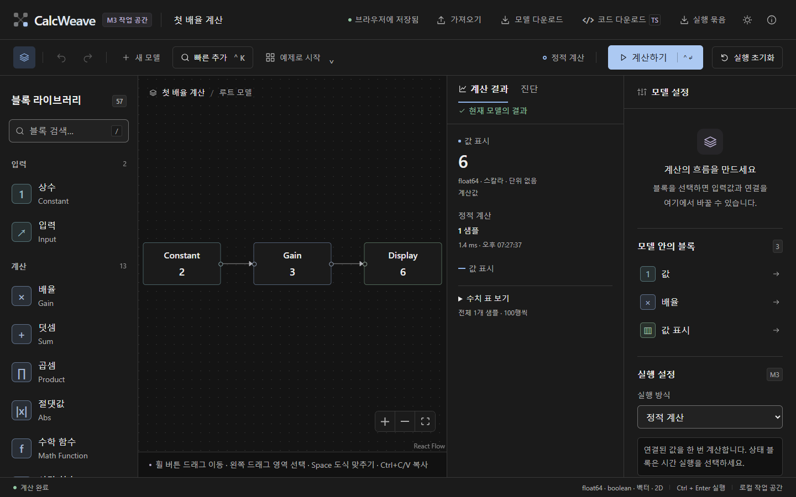

# CalcWeave M0 구현 및 검증 기록

> 작성일: 2026-10-02 · 앱 0.0.1 / 엔진 `0.0.1-m0` · 상태: 실행 가능한 핵심 실험, 종료 게이트 부분 충족
>
> [구현 계약](m0-contract.md) · [마일스톤](03-milestone-roadmap.md) · [SANE 화면 수정](04-sane-design-revision.md) · [실행 방법](../README.md)

## 구현 결과

이 문서는 M0 단계의 이력이다. 현재 앱의 구현·자동 검증 결과는 [M1 검증 기록](m1-validation.md)에 추가한다.

`모델 JSON → 블럭 계약 검사 → immutable IR → Worker 계산`과 `같은 IR → 독립 TypeScript 코드`를 실제 프로그램으로 연결했다. 편집기는 블럭 검색·추가·선택·연결·숫자 변경·계산·취소·진단·undo/redo·로컬 저장·JSON 가져오기/다운로드·TS 다운로드를 제공한다. 기본값을 생략한 모델도 컴파일 단계에서 정규화하며 이름과 위치만 변경하면 계산 결과를 오래된 것으로 바꾸지 않는다.

현재 registry는 Constant, Input, Gain, 두 입력 Sum, 두 입력 Product, Display, Unit Delay, Integrator의 8개 finite float64 scalar 계약이다. 이산 상태는 같은 틱의 이전 값을 읽은 뒤 다음 상태를 함께 commit한다. 연속 실행은 사건과 이산 상태가 없는 자율 ODE의 고정 간격 RK4로 한정한다. 연속 모델 TS export는 명시적으로 차단한다.

원본 데이터셋 385행의 ID·이름·조건·원본 위치를 보존했다. 실제 registry와 대응하는 16개 원본 행은 `M0 실험·스칼라 subset`, 나머지 369행은 `미구현`이다. 중복 분류를 별도 엔진 수로 세지 않았다. M1 시작 후보 22개의 이름·canonical ID·원본 ID는 구현 계약에 기록했다.

2026-10-02 사용자 피드백에 따라 SANE 화면 수정을 반영했다. 기본 테마는 검정·차콜 다크모드이며 선택한 다크·회색 라이트 설정을 브라우저에 기억한다. 본문·입력은 16px, 중요한 보조 라벨은 14px를 기준으로 유지하고 좁은 화면에서는 배치를 바꾼다. 캔버스는 영어 종류 이름과 핵심 숫자만 표시하며 Sum·Product처럼 숫자 파라미터가 없는 블럭은 이름만 표시한다. 사용자 label과 연결·파라미터 의미는 속성·모델 목록·접근 가능한 이름에 보존한다.

정적 계산은 한 점의 큰 그래프 대신 값과 표를 제공한다. 시간 그래프는 최대 10,001개 샘플을 모두 그려 짧은 피크를 보존하며 축 글자는 HTML로 표시한다. 표는 100행 단위로 전체 샘플에 접근한다. 데스크톱 중앙은 캔버스 왼쪽·결과 오른쪽으로 전체 높이를 사용하며, 태블릿에서는 속성을 아래로 옮기고 작은 화면·글자 확대에서는 세로 배치한다. 실행 시 로고에 은은한 펄스가 흐르고 취소·오류 시 즉시 멈춘다. 짧은 계산의 최소 1.4초 장식 효과는 실제 완료 상태를 늦추지 않으며 모션 감소 설정에서는 정적인 강조를 사용한다. 수치·실행·export의 M0 지원 범위는 이번 화면 수정으로 확장하지 않았다.

## 검증 결과

| 검사 | 결과 및 근거 |
| --- | --- |
| 모델·컴파일·수치·TS·Worker 회귀 | `npm test` — 5개 파일, 46개 테스트 통과 |
| 타입과 배포용 파일 생성 | `npm run build` 통과. 공개 배포는 수행하지 않음 |
| SANE 수정 전 실제 브라우저 흐름 | `npm run test:e2e` — Chromium 153.0.8010.12, 기존 11개 테스트 통과 |
| SANE 수정 후 실제 브라우저 흐름 | `npm run test:e2e` — Chromium 153.0.8010.12, 기존 흐름·테마 기억·간결한 블럭/전체 표 접근·좌우 배치·실행 로고를 포함한 17개 테스트 통과 |
| SANE 화면 측정 | `npm run verify:design` 통과. [렌더링·폰트·너비·대비 측정 근거](evidence/sane-design-verification.json): 페이지 오류·가로 넘침·블럭 텍스트 잘림·세로 마킹 없음. 확인한 주/보조/강조 텍스트 조합은 4.5:1 이상 |
| 원본 자료 보존 | `npm run verify:coverage` — 원본/대응표 385행, 중복 ID 0, SHA-256 일치 |
| 의존성 공개 취약점 조회 | 2026-10-02 `npm audit --json` — 보고된 취약점 0개. 애플리케이션 전체 보안 감사와는 범위가 다름 |
| 독립 코드 실행 | 생성한 TypeScript를 별도 ESM 파일로 변환·실행하고 손계산 14 및 피드백의 모든 샘플·최종 상태를 런타임과 비교 |

브라우저 검사는 정적 계산·변경 후 재실행·저장 재열기, 이산 수열·RK4 해, 기본값 생략·HTML처럼 보이는 label, 잘못된 가져오기·순환 진단, 읽을 수 없는 저장본의 보존·명시적 복구, 연결 변경·undo·ID 재사용 방지, 파일 다운로드, 취소 후 새 실행, 잘못된 숫자 draft, 검색, 로컬 미리보기 보안 헤더를 확인했다. 수정본의 기본 다크 테마·선택 기억, 종류 이름/핵심 숫자 표시, 중간 샘플을 포함한 표 페이지 접근까지 같은 흐름에서 다시 확인했다. 좌우 배치·작은 화면의 재배치, 빠른 계산의 펄스, 실행 중 반복·취소·오류·모션 감소 설정도 확인했다. 로고의 실행 중 취소 검사에서는 실제 Worker의 진행 메시지는 즉시 전달하고 결과 전달만 지연해 테스트 클릭 전에 실행 버튼으로 바뀌는 경합을 제거했다. 실제 취소 메시지와 2초 내 취소·장식 종료를 검증한 것으로 엔진 성능 측정과 구분한다. 자동화는 실제 초보 사용자의 이해도 조사와 구분한다.

SANE 수정본의 최종 빌드는 성공했으며 약 552 kB(압축 약 171 kB)의 메인 JavaScript 청크에 크기 경고가 남았다. M1에서 편집기·결과·코드 생성 기능의 로딩 분리와 최초 로딩 시간을 함께 검토한다. 현재 수치 측정은 이 번들의 네트워크 로딩 시간을 포함하지 않는다.

## 기준 환경과 수치 측정

[원시 측정 JSON](evidence/m0-benchmark.json)의 환경은 Windows 10.0.26200, Intel Core i7-13620H, 논리 CPU 16개, RAM 63.71 GiB, Node.js 25.9.0이다. scalar Gain chain을 5번 예열하고 20번 측정했다. 컴파일과 런타임 시간은 별도로 기록했으며 화면 렌더링·Worker 시작·메시지 전달은 아래 Node 측정에 포함하지 않는다.

| 규모 | 컴파일 중앙값 / p95 | 정적 런타임 중앙값 / p95 | 해석 기준과 절대 오차 |
| ---: | ---: | ---: | ---: |
| 100노드 / 99연결 | 6.835 / 9.487 ms | 0.072 / 0.134 ms | 0 |
| 1,000노드 / 999연결 | 60.931 / 78.995 ms | 0.518 / 0.619 ms | 1.78 × 10⁻¹⁵ |

감쇠 모델 `x′=-x`, `x(0)=1`, 종료 시간 5의 해석해는 `exp(-5)`다.

| 시간 간격 | 마지막 값 | 절대 오차 |
| ---: | ---: | ---: |
| 0.2 | 0.00673847789038425 | 5.31 × 10⁻⁷ |
| 0.1 | 0.00673797751675499 | 3.05 × 10⁻⁸ |
| 0.05 | 0.00673794882846059 | 1.83 × 10⁻⁹ |

간격을 절반으로 줄일 때 오차 비율은 약 17.4와 16.7로, 이 fixture에서 RK4의 4차 수렴과 일치한다. 모든 연속 모델의 정확도를 보장하는 결과로 일반화하지 않는다.

Node cooperative 취소는 progress callback의 AbortSignal 요청 후 반환까지 3.851 ms였다. [실제 Chromium 취소 기록](evidence/m0-browser-cancellation.json)은 1,000노드·10,000구간 이산 모델에서 cancel 메시지부터 Worker 종료까지의 시간과 브라우저 버전을 기록한다. 1초 목표를 회귀 검사하며, 단일 측정값을 p95나 모든 기기의 보장으로 해석하지 않는다. 하드 watchdog·전송 실패·이전 메시지의 정리는 가짜 시간과 Worker stub으로 별도로 검증했다.

## 화면 확인

현재 SANE 수정본의 렌더링은 [디자인 측정 기록](evidence/sane-design-verification.json), [다크 화면](evidence/sane-dark-editor.png), [라이트 화면](evidence/sane-light-editor.png), [연속 결과](evidence/sane-continuous-result.png), [태블릿](evidence/sane-tablet-editor.png), [390px 화면](evidence/sane-mobile-editor.png), [320px 화면](evidence/sane-narrow-editor.png)에 기록한다. 본문·입력과 보조 라벨, 그래프 축 글자, 실제 한글 서체(Malgun Gothic), 가로 넘침·블럭 마킹과 글자 잘림을 확인했다. 블럭명은 기본 20px이며 자동 맞춤 zoom 0.8에서도 16px로 표시된다. 200% 글자 확대에서는 블럭명 40px·값 48px로 확대되며 헤더 줄바꿈·블럭 자동 높이로 텍스트를 보존한다. 연결선 끝과 보이는 포트 원의 경계도 정렬했고, 8px 원 주위의 24px 클릭 영역을 유지했다.

[720×450 CSS viewport의 200% 브라우저 확대 대응](evidence/sane-zoom-equivalent.png)과 [루트 글자 크기 200% 확대](evidence/sane-text-200-percent.png)는 서로 다른 검사다. 확대에 대응하는 viewport 측정만으로 실제 브라우저의 모든 확대 동작이나 WCAG 준수를 입증하지 않는다. M0의 사용성 기준은 데스크톱이며 모바일 전체 편집 경험이나 실제 초보 사용성 조사가 완료된 상태는 아니다.

이전 M0 화면 근거도 보존한다. 최초 1440×900 데스크톱에서 기본 계산과 연속 결과·다크 테마를 확인했고, 390px 화면에서는 패널의 세로 배치와 라이브러리 가로 이동을 확인했다. [최초 데스크톱](evidence/m0-desktop-editor.png) · [이전 연속 결과](evidence/m0-continuous-result.png) · [이전 이산 결과](evidence/m0-discrete-result.png) · [이전 다크 테마](evidence/m0-dark-editor.png) · [이전 좁은 화면](evidence/m0-mobile-editor.png)

## 입력·실행·저장 보호

- JSON은 파싱 전 5 MiB·중첩 상한, 파싱 후 필드·길이·ID·예약 키·노드·연결·값 범위를 검사한다. Worker에서도 모델을 다시 컴파일한다.
- 계산은 허용 블럭만 실행한다. `eval`, `new Function`, 사용자 HTML 실행 경로를 사용하지 않는다. label은 React 텍스트 출력이며 코드 생성 문법에 삽입하지 않는다.
- 구간 10,000개, 기록 숫자 1,000,000개(시간축 포함), 연산과 wall time 예산을 둔다. 순환 진단은 최대 20개·경로 12개 ID로 제한해 오류 응답 증폭을 막는다.
- 실행·취소 전송 실패 시 Worker·타이머를 정리한다. 이전 실행의 메시지와 watchdog는 최신 실행을 해제하지 않는다.
- 저장본 읽기 실패 후 기본 예제가 자동으로 원본을 덮어쓰지 않는다. 저장 재개 시 손상·미래 버전 원본을 같은 transaction에서 복구 슬롯에 보존한다. 복구 슬롯을 UI에서 다시 여는 기능과 여러 탭 충돌 처리는 후속 작업이다.
- 개발·미리보기 서버는 127.0.0.1에만 열고 script/Worker 출처, 프레임 삽입, MIME sniffing을 제한한다. 운영 호스팅의 HTTPS·헤더·정책은 배포 단계에서 별도로 설정해야 한다.

보안 기준 8개 항목을 자체 점검했다. SQL·서버 API·인증·쿠키·계정 DB·개인정보 수집이 없는 로컬 모델 도구이므로 해당 영역의 구현은 없다. 클라우드 저장·계정·결제 추가 시 인가·rate limit·DB 권한·개인정보 절차를 새 경계에서 적용해야 한다.

## 남은 M0 게이트와 다음 구현 순서

실행 기반은 확보했으나 M0 전체를 완료로 선언하지 않는다. 실제 초보 사용자의 선택·연결·설정·오류 수정 관찰, 기준 브라우저의 반복 성능·전체 메모리 측정, Rate Transition 명세의 실행 fixture, 도메인·브랜드의 외부 확인, 종료 검토가 남아 있다. boolean/vector/2D·단위·수식 AST는 문서의 방향을 바탕으로 M1 세부 계약을 확정해야 한다.

M1의 첫 구현 묶음은 다음 순서로 진행한다.

1. scalar/boolean/vector/2D 타입과 shape inference, 정의역·단위 진단을 먼저 추가한다.
2. 22개 후보를 산술·논리·선택·벡터 묶음으로 나누고, 블럭마다 계약·경계 fixture·화면 진단을 함께 추가한다.
3. 제한 수식 AST, Quick Insert·다중 선택·복사, 복구본 다운로드·여러 탭 저장 충돌을 연결한다.
4. 첫 사용자 과제와 저장·재열기·오류 복구를 조사하고 결과에 따라 범위를 조정한다.

초기 M1 6~10주 추정은 팀 구성·사용자 조사·고급 shape 작업에 대한 가정을 유지한다. 이번 scalar spike의 속도만으로 제품 구축 기간을 축소하지 않는다. 첫 M1 타입·shape 묶음의 실제 작업량을 측정한 뒤 추정을 갱신한다.
