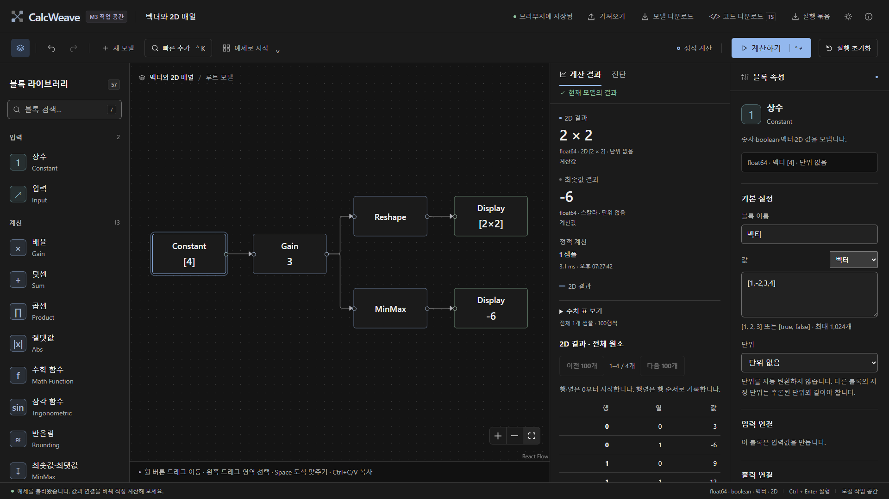

# CalcWeave M1 구현 및 검증 기록

> 2026-10-02 · 앱 0.1.0 / 엔진 `0.1.0-m1` · 구현·자동 검증 통과, 마일스톤 전체 종료는 보류
>
> [구현 계약](m1-contract.md) · [마일스톤](03-milestone-roadmap.md) · [M0 기록](m0-validation.md)

## 구현 범위

M0의 22종 시작 후보와 Expression을 정적 계산으로 확장한다. 기존 Unit Delay·Integrator 두 실험을 보존하며 registry는 25종, 정적 계산 지원은 23종이다. 함수·shape·단위·포트·자원·export의 실제 경계는 구현 계약을 기준으로 한다.

float64·boolean scalar/vector/2D, row-major Reshape, 원소별 산술·비교·논리, boolean scalar Switch, vector Mux/Concatenate와 실제 여러 출력 Demux, 허용 함수와 제한 AST를 연결한다. 숫자와 boolean을 자동 변환하지 않고 모든 배열 신호를 1,024원소 이하로 제한한다. 단위는 동일 토큰 검사와 제한적인 전파이며 자동 단위 변환이나 일반 차원 대수를 제공하지 않는다.

정적 계산의 23종과 배열·AST는 독립 TS 실행 parity를 통과했다. 이산·연속은 기존 scalar 계약을 유지하며 연속 export는 계속 차단한다.

편집기는 Ctrl+K 빠른 추가와 6개 프리셋, 다중 선택·내부 연결을 포함한 복사·복제·삭제·undo, typed 속성·수식·단위 편집과 포트 위치 진단을 제공한다. 결과는 scalar 요약과 배열 전체 원소의 100개 단위 표를 제공한다. 저장은 이전 유효 모델 한 개와 읽지 못한 원본을 구분해 확인·파일 다운로드하며, 이전 모델 복원은 undo할 수 있다. 기존 데이터베이스 키와 schema v1 모델을 유지한다.

## 학습 fixture와 정답

| fixture | 독립적으로 계산한 기대값 |
| --- | --- |
| `budget-calculator` | `12500 × 3 − 2500 = 35000` |
| `vector-shape` | `[1,-2,3,4] × 3`을 2×2로 재배치: `[[3,-6],[9,12]]`, 전체 최솟값 `-6` |
| `formula-calculator` | `x=3`, `sqrt(x^2+7)=4` |
| `unit-scale` | `1.5m × 2 + 0.5m = 3.5m` |

`npm run verify:m1`은 예제를 JSON으로 저장·재열기하고 이 정답과 비교하며 100/1,000노드 × 64원소 Gain chain을 측정한다. 컴파일과 런타임을 분리하고 2회 예열·10회 반복한다. Node 측정을 브라우저 렌더링·전체 메모리·사용자 경험의 성능 보장으로 일반화하지 않는다.

## 자동 검증 결과

| 검사 | 2026-10-02 결과와 범위 |
| --- | --- |
| `npm test` | 6개 파일·196개 통과: 모델/컴파일러 39, 수식 4, 런타임 79, TS 생성 68, Worker client 6 |
| `npm run build` | TypeScript 검사와 production build 통과. 아래 번들 경고는 남음 |
| `npm run test:e2e` | Chromium 153.0.8010.12·27개 통과. 기존 17개 회귀, M1 8개 편집·실행·복구·진단, 첫 로딩·지연 저장 복원 2개 |
| `npm run verify:m1` | 4개 학습 예제의 손계산·JSON roundtrip, registry 25/static 23과 벡터 체인 측정 통과. [원시 기록](evidence/m1-verification.json), [fixture](../fixtures/m1) |
| `npm run verify:coverage` | 385개 원본행·추적행 일치, ID 중복 0, 원자료 SHA-256 보존 |
| `npm run verify:design` | 양 테마, 1440/1920 데스크톱·1024/900 태블릿·390/320 좁은 화면·720 확대 상당 viewport·200% 글자 확대, 배열 결과·빠른 추가·긴 블럭 이름 통과. [측정 기록](evidence/sane-design-verification.json) |

수치 검사는 모든 정적 canonical 블럭과 승인 enum 옵션, boolean 불변환, scalar broadcasting·vector·2D, Demux의 출력 ID와 16개 포트, 정의역·0 제수·overflow, AST 문법·깊이·노드 상한·임의 코드 거부를 포함한다. 생성 TS는 독립 실행 parity와 엄격한 TypeScript 검사, 기록 배열 수정 후 재실행을 확인했다. 한 신호·중간 값·기록·원소 연산/AST 예산, 기존 상태·RK4 회귀와 Worker 중단도 포함한다.

브라우저에서는 학습 예제, boolean·6개 프리셋, 입력 편집 중 단축키 보호, 내부 연결 포함 복사와 고유 ID, 동적 Demux 포트 정리·undo, null/object 입력 수정, 배열·수식 invalid draft 차단·수정, 저장본 다운로드·복원·undo, 손상 원본 보존·다운로드, shape/unit 포트 진단 수정 경로를 검증했다. 좌우 배치·검정/회색 테마·간결한 블럭·실행 펄스·모션 감소 회귀도 통과했다.

첫 로딩은 저장 복원과 현재 블럭·캔버스 측정 후 한 번만 자동 맞춘다. 1440/1920px에서 기본 예제와 지연된 실제 저장 복원, 원점에서 멀리 있는 도식의 중심·전체 노드, 모델 좌표 보존과 이후 사용자 확대·이동 유지가 통과했다. [첫 화면 수정 기록](04-sane-design-revision.md#첫-로딩의-도식-맞춤)과 [화면](evidence/initial-canvas-fit.png)을 추가했다.

화면 측정에서 중요한 글자는 14px 이상, 자동 맞춤 블럭명은 유효 16px 이상이며 주요 텍스트는 양 테마에서 4.5:1 이상의 대비를 유지했다. 페이지 전체 가로 넘침·블럭 텍스트 잘림·런타임 화면 오류가 없었다. 이는 접근성 인증이나 사용자 조사 결과가 아니다.

### 벡터 체인 실측

Windows 11 `10.0.26200`, Node `25.9.0`, i7-13620H·논리 CPU 16개에서 신호마다 64원소인 Gain 체인을 2회 예열·10회 반복했다. 최종 측정은 다른 CalcWeave 자동 테스트와 병렬 실행하지 않았다. 단위는 ms이며 p95는 이 10회 표본의 nearest-rank 값이다.

| 노드 | 컴파일 median / p95 | 런타임 median / p95 | 최대 절대 오차 |
| ---: | ---: | ---: | ---: |
| 100 | 4.161 / 5.778 | 0.533 / 0.934 | 4.97×10⁻¹⁴ |
| 1,000 | 35.406 / 38.626 | 4.684 / 6.334 | 1.99×10⁻¹³ |

Node 커널 측정을 브라우저 초기 로딩·렌더링·전체 메모리·모든 모델의 성능 보장으로 해석하지 않는다. 첫 로딩 수정 후 main JS는 612.96kB(gzip 187.94kB), Worker JS는 138.25kB이며 Vite의 500kB 청크 경고가 남는다. 코드 분할과 실제 로딩 성능 확인을 후속 최적화 항목으로 기록하며 경고 기준을 올려 숨기지 않았다.

대응표에는 `M1 정적 subset` 40행·preset 4행·AST 독립 대체 1행, 기존 M0 상태 실험 3행만 구현으로 기록했다. 미구현은 337행이며 중복 원본행을 별도 엔진 수로 세지 않는다. 원자료 SHA-256은 `CFA9BC90F5FC50C64F85AABC3A3F74CC0329954289FF570618E94798524813D7`다.

## 보안·저장 경계

서버·계정·외부 API·개인정보 수집은 추가하지 않는다. 모델 JSON과 편집 입력은 길이·노드·연결·배열 상한을 검사하고 Worker에서 다시 컴파일한다. 수식은 문자열 실행 대신 AST를 사용하며 출력은 React 텍스트로 렌더링한다. 모델·복구본 다운로드는 로컬 파일이다. 손상·미래 버전 원본을 자동 저장으로 덮어쓰지 않는다.

내보내기 전 보안 8항목을 검토했다. 쿼리·인증·유료 호출·DB·쿠키가 없는 로컬 구조를 유지하고 시크릿·임의 HTML·외부 전송을 추가하지 않았다. 제한 AST와 입력 검증을 적용했고, 검토 중 발견한 잘못된 source 값 선택의 화면 오류와 모달 뒤 모델 단축키 동작을 수정했다. export 결과 배열의 별도 복사로 다음 실행의 원본 변경도 차단했다. 이는 서비스 공개 전 종합 보안 감사를 대신하지 않는다.

## 남은 종료 게이트

실제 예비 사용자 5명 중 4명 이상이 15분 안에 계산·설정·저장을 끝내는 `F01-first-use`는 별도 관찰이 필요하다. 자동화 결과를 이 사용성 조사로 대체하지 않는다. 브라우저 반복 성능·전체 메모리와 도메인·브랜드 외부 확인 등 남은 M0 게이트도 유지한다. M1 코드 구현과 자동 검증이 통과해도 이 관찰·확인까지 완료되었다고 선언하지 않는다.
